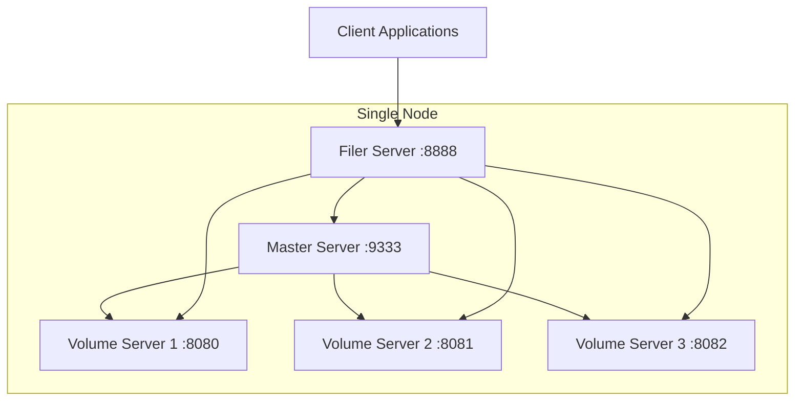

# SeaweedFS Single-Node Test Setup Architecture

## Overview
This document describes a test setup for SeaweedFS on a single node with:
- 1 Master Server
- 1 Filer Server
- 3 Volume Servers (Object Servers)

## Components

### Master Server
- **Purpose**: Manages volume servers, assigns file IDs, and coordinates data placement
- **Port**: 9333 (default)
- **Command**: `weed master`

### Filer Server
- **Purpose**: Provides filesystem-like operations, manages metadata
- **Port**: 8888 (default)
- **Command**: `weed filer`
- **Dependencies**: Requires Master Server

### Volume Servers (Object Servers)
- **Purpose**: Store actual data files, handle read/write operations
- **Ports**: 8080, 8081, 8082 (one per server)
- **Command**: `weed volume`
- **Dependencies**: Require Master Server

## Architecture Diagram

## Data Flow
1. Clients connect to Filer Server for filesystem operations
2. Filer Server communicates with Master Server to get volume assignments
3. Master Server directs operations to appropriate Volume Servers
4. Volume Servers handle actual data storage and retrieval

## Configuration Notes
- All components run on the same machine
- Use different ports to avoid conflicts
- Volume servers use separate data directories
- Master server coordinates all volume servers
- Filer server provides unified filesystem interface

## Prerequisites
- Linux/Windows/macOS
- Go 1.19+ (for building from source) or pre-built binaries
- Sufficient disk space for data storage
- Network ports 9333, 8888, 8080-8082 available